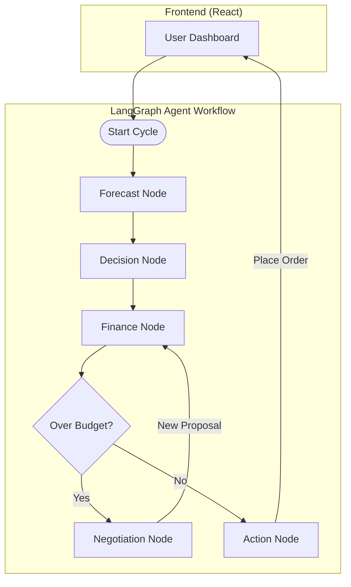

# 🤖 Smart Supply Chain Agent

> **Your Autonomous AI Supply Chain Manager**

## 🛑 The Problem: Supply Chain Chaos
In most companies, supply chain management is a constant battle between three departments:
1.  **Sales**: "Buy more! We can't run out of stock!"
2.  **Finance**: "Stop spending! We need to save cash."
3.  **Procurement**: "I'm stuck in the middle trying to make everyone happy."

**The Result?**
*   **Stockouts**: You lose customers because you ran out of popular items.
*   **Overstock**: You waste money buying things that sit in a warehouse collecting dust.
*   **Slow Decisions**: By the time humans agree, the market has changed.

---

## 👥 Who Uses This?
*   **Supply Chain Managers**: To automate ensuring stock availability without manual calculation.
*   **CFOs & Finance Directors**: To enforce strict budget controls without micromanaging every purchase order.
*   **Procurement Officers**: To eliminate the manual back-and-forth negotiation emails.

---

## 💥 What Breaks Without It?
Without this autonomous agent, businesses rely on **Siloed Decision Making**:
*   Sales data sits in one sheet, Finance budget in another.
*   Decisions are made on "gut feeling" or outdated simple averages.
*   **Catastrophic Scenario**: A sudden demand spike for a trending item occurs. The manual team is too slow to react or Finance blocks the larger PO because "it's over budget". Result: Competitors capture the market.

**This Agent fixes that by acting as a real-time bridge.**

---

## 🏗️ Architecture
This system is not a simple script. It is a multi-agent workflow orchestrated by **LangGraph**.



### How it works effectively:
1.  **Forecast Node**: Uses **Hybrid Intelligence** (Stats + LLM) to predict demand.
2.  **Decision Node**: Uses **Linear Programming (PuLP)** to calculate the mathematically optimal order quantity.
3.  **Finance Node**: Applies strict budget constraints.
4.  **Negotiation Node**: The "Brain" of the operation. If rejected, it uses an LLM to generate a counter-proposal (e.g., "Cut the slow movers, keep the best sellers") and re-submits to Finance.

---

## 🌪️ Failure Scenarios
We designed the system to handle real-world messiness:

1.  **"Computer says No" (Budget Impossible)**
    *   *Scenario*: Budget is $0 or too low to buy even critical items.
    *   *Handling*: The Optimization Node detects infeasibility. Instead of crashing, it returns an "Infeasible" status and alerts the human user to intervene.

2.  **LLM Hallucinations**
    *   *Scenario*: The LLM tries to order "1 million units" or outputs garbage text.
    *   *Handling*: We use **Structured Output Parsers (Pydantic)**. If the LLM output violates the schema, the system automatically retries or defaults to a safe fallback (0 units) to prevent financial damage.

3.  **API Outages**
    *   *Scenario*: Groq/OpenAI API is down.
    *   *Handling*: The system creates an error log but preserves the Local State (PostgreSQL). You don't lose your inventory data; you just temporarily lose the "Smart" features.

---

## ⚖️ Tradeoffs We Made
Every engineering choice has a cost. Here is why we chose what we chose:

1.  **LangGraph vs. Simple Scripts**
    *   *Tradeoff*: Complexity vs. Capabilities.
    *   *Why*: Simple scripts are linear. Real supply chain negotiations are **Cyclic** (Propose -> Reject -> Propose -> Accept). LangGraph handles this stateful looping natively.

2.  **Hybrid Intelligence (Optimizers + LLMs)**
    *   *Tradeoff*: Determinism vs. Flexibility.
    *   *Why*: We use **Math (PuLP)** for quantities because we don't trust LLMs to do math. We use **LLMs** for *negotiation strategy* because math can't "argue" effectively.

3.  **Synchronous UI**
    *   *Tradeoff*: Immediate Feedback vs. Scalability.
    *   *Why*: We use Server-Sent Events (SSE) to show the agent "thinking" in real-time. This keeps the user engaged but holds a connection open. For millions of users, we would move to Async Webhooks.

---

## 🔮 What We Would Improve (With More Time)
1.  **Real ERP Integrations**: Replace the SQL mock database with One-Click connections to **Shopify, SAP, and Netsuite**.
2.  **Authentication**: Add User Roles (Admin vs. Viewer) using Auth0 or Supabase Auth.
3.  **More Advanced Forecasting**: Implement Prophet or ARIMA models for seasonality detection (e.g., holiday spikes).
4.  **Human-in-the-Loop Override**: Allow a human manager to "force approve" a budget violation before the final order is placed.

---

## 🚀 Quick Start & Tech Stack

### Tech Stack
*   **Brain**: LangGraph, Groq (Llama 3), PuLP (Optimization)
*   **Backend**: FastAPI, PostgreSQL
*   **Frontend**: React, Tailwind CSS

### Setup
1.  **Backend**:
    ```bash
    git clone https://github.com/ahmadarif238/Smart-SupplyChain-Agent.git
    cd Smart-SupplyChain-Agent
    python -m venv myenv
    source myenv/bin/activate
    pip install -r requirements.txt
    cp .env.example .env  # Add your GROQ_API_KEY
    uvicorn main:app --reload
    ```

2.  **Frontend**:
    ```bash
    cd react-app
    npm install
    npm run dev
    ```

**⭐ Star this repo if you find it useful!**

